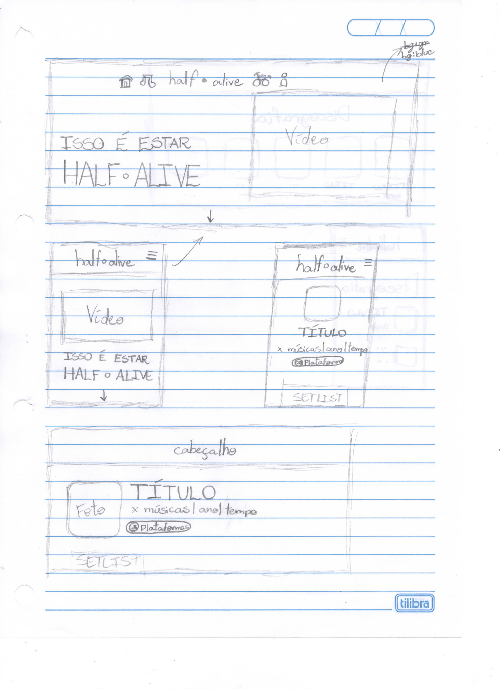
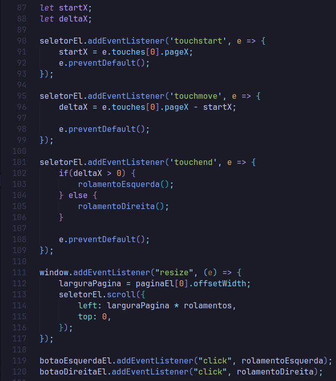
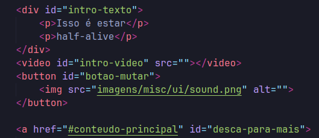
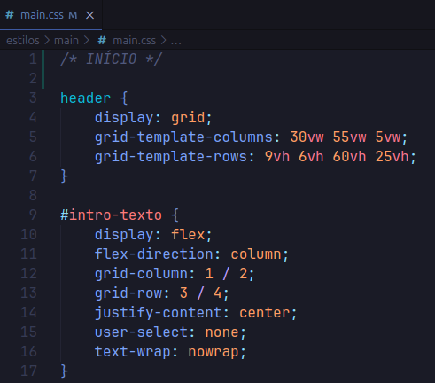

# URL do site
https://jeanc4rlo.github.io

# Itens Opcionais

## Comprehensive Layout

## Interação
A interação foi feita através de um seletor de álbuns (no momento, sem os botões para acessar diretamente suas páginas no site), assim o usuário pode ver quais são os álbuns da banda tanto pelos botões (em telas médias e maiores) quanto por deslizar o seletor (em dispositivos touch).

## Exibição de um vídeo

## Flexbox e/ou grid

